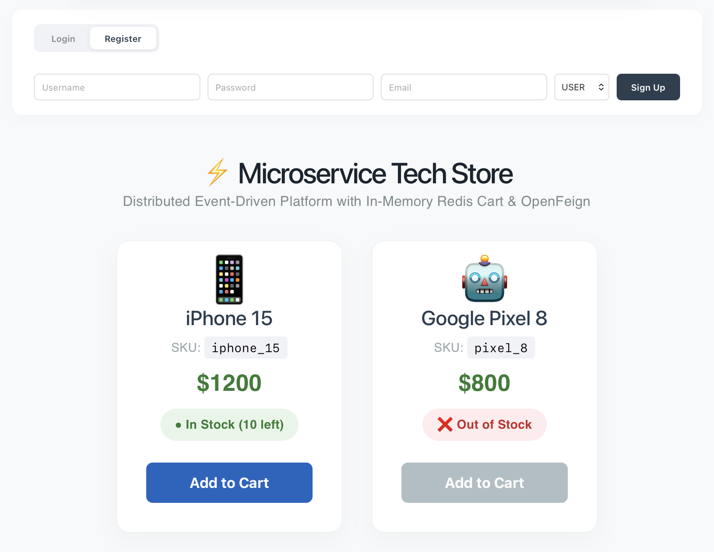
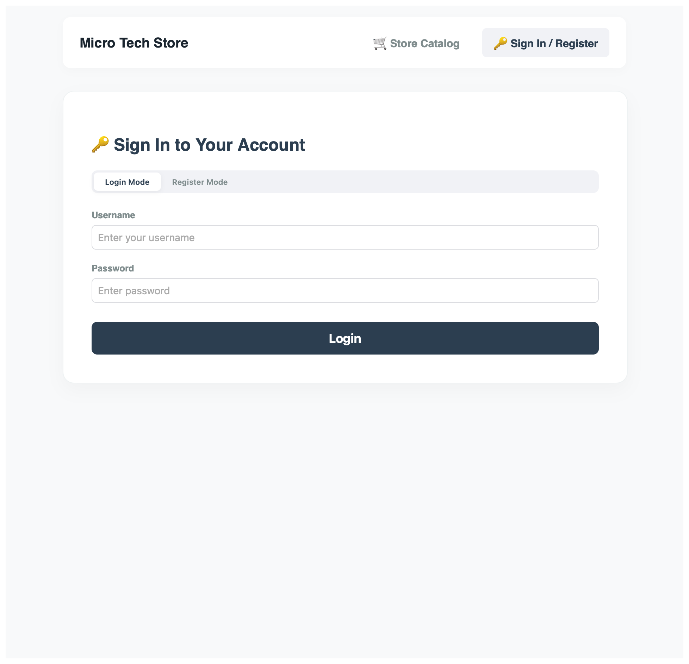
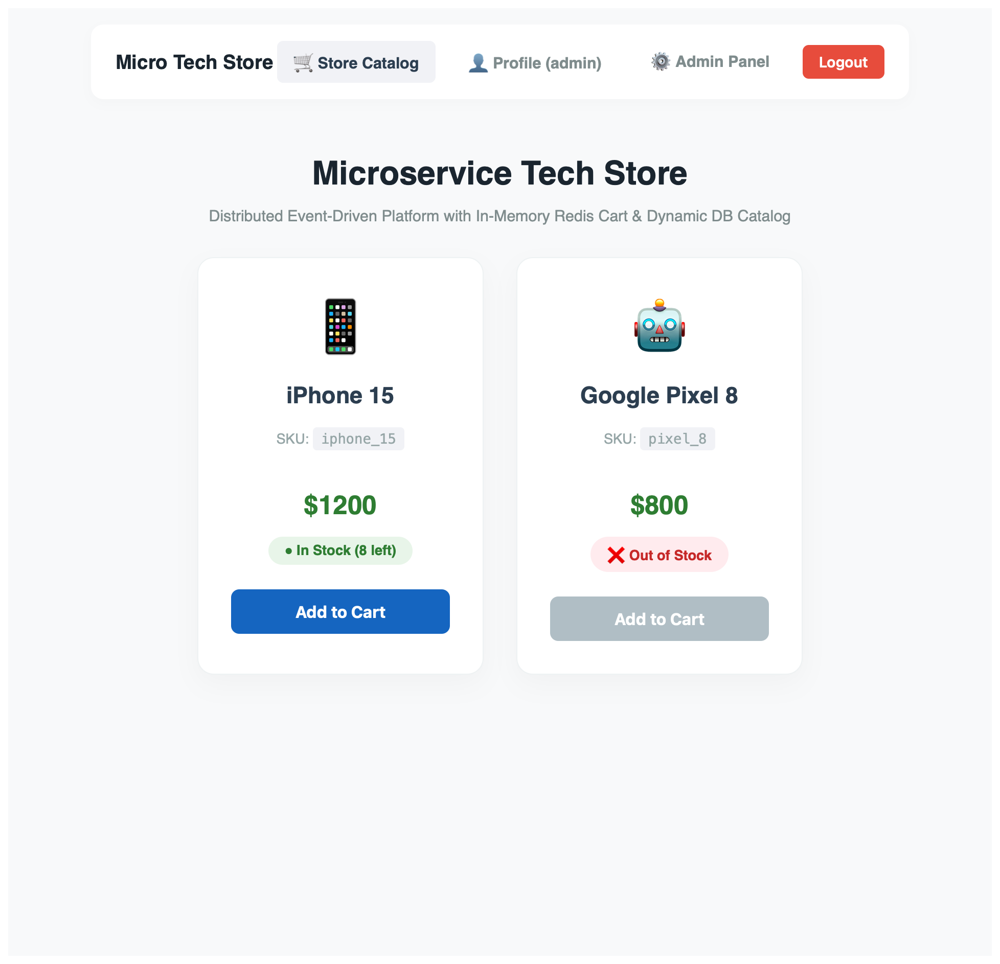
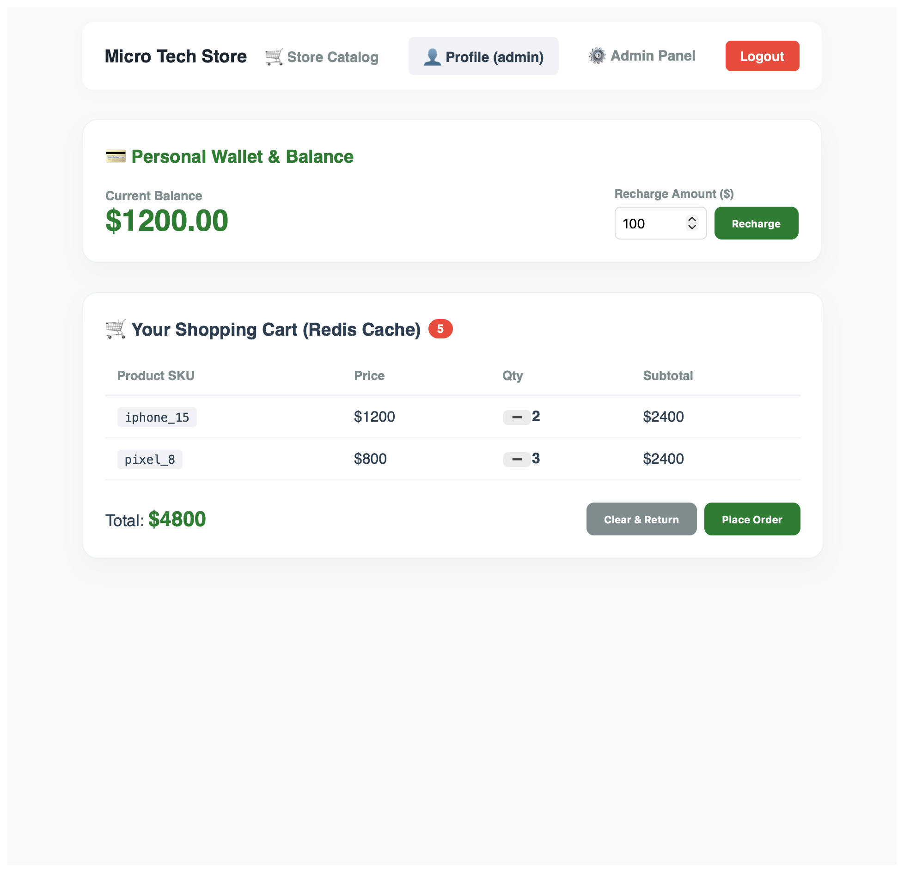
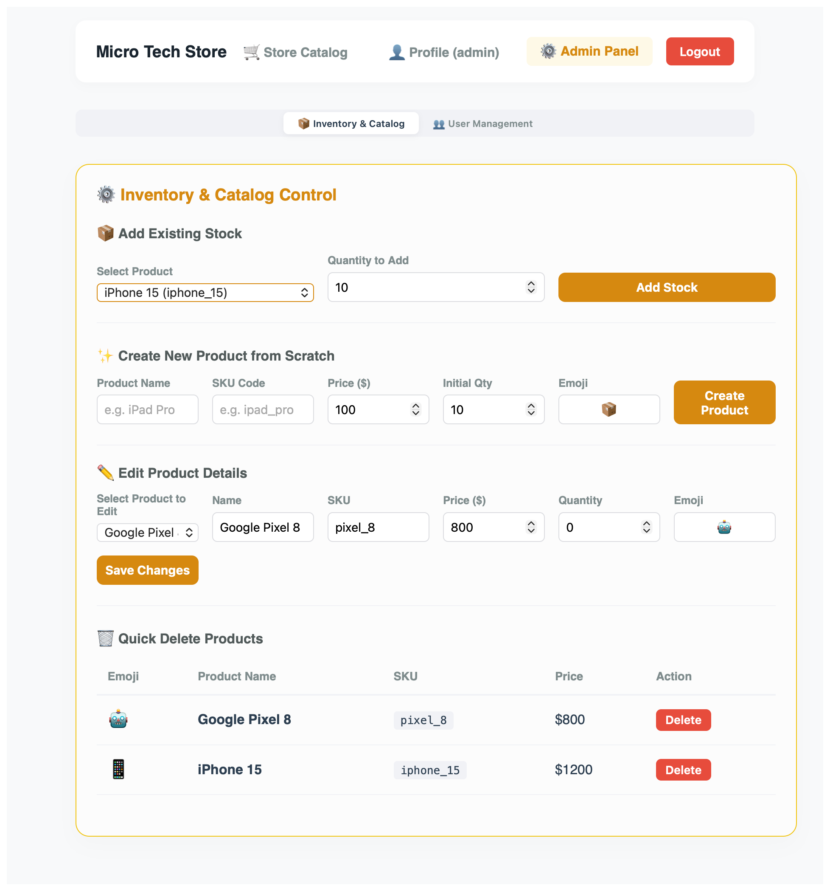
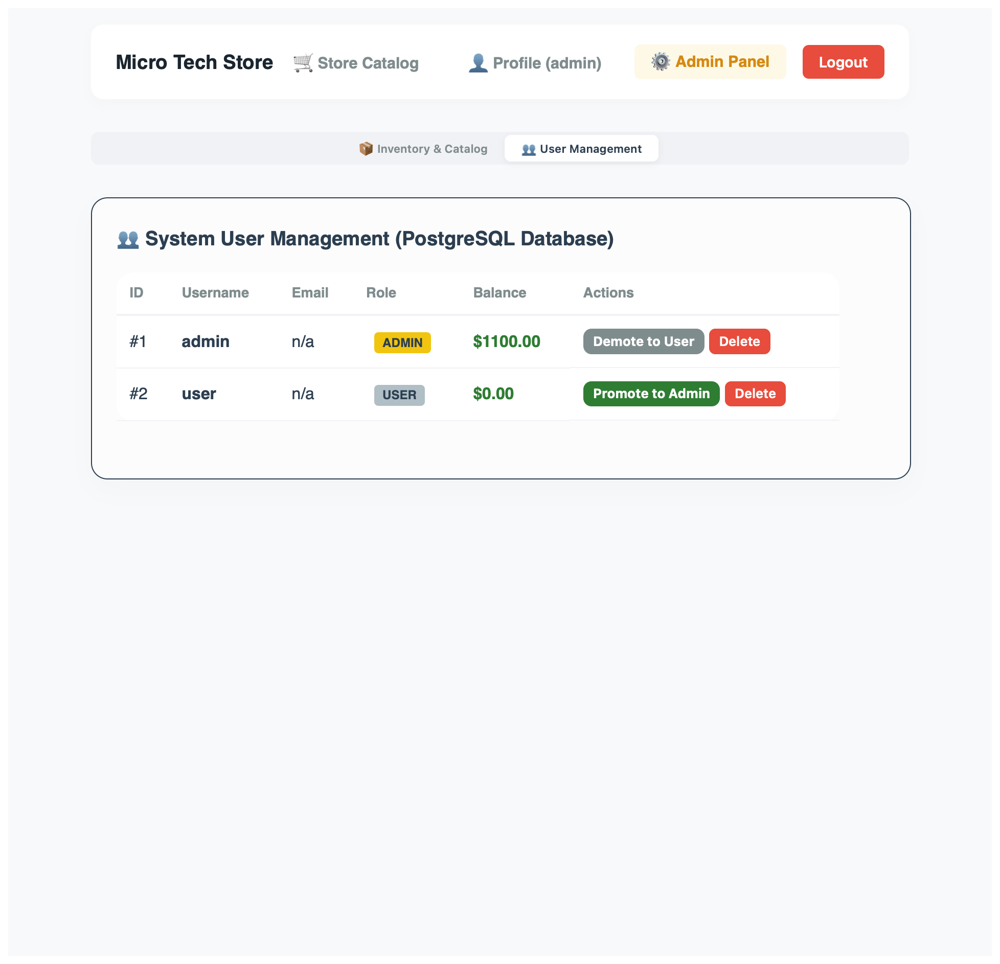

# Microservice Tech Store

Высоко нагруженное отказоустойчивое Full-Stack приложение для заказа техники, построенное на базе микросервисной
архитектуры с использованием **Spring Boot 3**, **Spring Cloud**, **Apache Kafka**, **Redis**, **PostgreSQL** и
**Vue 3**.

Проект разработан с учетом современных паттернов проектирования распределенных систем, снабжен сквозным мониторингом,
покрыт интеграционными тестами с использованием **Testcontainers** и интегрирован в автоматический пайплайн **CI/CD** на
базе GitHub Actions.

---

## Архитектурная схема системы

```text
                                     +----------------------+
                                     |   discovery-server   | (Eureka)
                                     +---------+------------+
                                               ^
                                               | (Регистрация)
                                               v
[ Браузер (Vue 3) ] ---> :3000 (Nginx)         |
      |                                        |
      | HTTP (CORS)                            |
      v                                        |
[ api-gateway (:8080) ] <----------------------+
      |
      +---+---> HTTP (Feign) ---> [ user-service (:8084) ] -------> PostgreSQL (user_db)
          |
          +---> HTTP (Feign) ---> [ cart-service (:8085) ] -------> NoSQL Redis (cart-redis)
          |                             |
          |                             +---> HTTP (Feign) --+
          |                                                  |
          +---> HTTP (Feign) ---> [ order-service (:8081) ]  | ---> PostgreSQL (order_db)
          |                             |                    |
          |                             +--- (Проверка) -----+
          |                                                  v
          +---> HTTP (Feign) ---> [ inventory-service (:8082) ] --> PostgreSQL (inventory_db)
                                        |
                                        +---> [ Apache Kafka ] ---> [ notification-service (:8083) ]
                                                    ^
                                                    |
                                            [ Zipkin (:9411) ] (Сбор трассировок)
```

---

## Технологический стек

| Направление                    | Технологии                                                                                                             |
|:-------------------------------|:-----------------------------------------------------------------------------------------------------------------------|
| **Бэкенд**                     | Java 21, Spring Boot 3.2.x, Spring Cloud (Gateway, OpenFeign, LoadBalancer, Eureka Server/Client)                      |
| **Фронтенд**                   | Vue 3 (Composition API), Vite Router (клиентская маршрутизация), Axios, HTML5/CSS3 (Grid, Flexbox, Сплит SPA на views) |
| **Безопасность**               | Spring Security 6, JWT (JSON Web Tokens), BCrypt хэширование, Role-Based Access Control (RBAC)                         |
| **Базы данных**                | PostgreSQL 15, Redis 7 (In-Memory кэш), Схема "Database per Service"                                                   |
| **Брокер сообщений**           | Apache Kafka, Zookeeper (Асинхронные события)                                                                          |
| **Мониторинг (Observability)** | Micrometer Tracing, Brave, OpenZipkin (Распределенная трассировка)                                                     |
| **Тестирование**               | JUnit 5, Spring Boot Test, Testcontainers, PostgreSQL Testcontainer, MockMvc                                           |
| **DevOps & CI/CD**             | Docker, Docker Compose, Nginx (раздача фронтенда), GitHub Actions, GHCR (GitHub Container Registry)                    |

---

## Модули и Сервисы

Система состоит из 8 независимых контейнеров:

1. **`discovery-server` (:8761):** Реестр микросервисов (Netflix Eureka Server), обеспечивающий динамическое обнаружение
   сервисов (Service Discovery).
2. **`api-gateway` (:8080):** Единая точка входа в систему (Spring Cloud Gateway). Реализует глобальный CORS,
   динамическую маршрутизацию и централизованную безопасность (**Edge Security** и **RBAC**).
3. **`user-service` (:8084):** Сервис управления пользователями. Отвечает за регистрацию (BCrypt кодирование) и
   беспроводную (Stateless) авторизацию с генерацией JWT-токенов.
4. **`cart-service` (:8085):** Сервис корзины товаров на базе **NoSQL Redis**. Реализует паттерн временного
   резервирования складских остатков при добавлении товара в корзину.
5. **`inventory-service` (:8082):** Складской сервис и каталог товаров. Управляет каталогом и остатками товаров в
   PostgreSQL, обрабатывает синхронные запросы на проверку наличия, списание, возврат и полное админское CRUD-управление
   товарами
6. **`order-service` (:8081):** Сервис заказов. Сохраняет заказы в изолированную базу PostgreSQL. Интегрирован с Kafka
   для отправки асинхронных уведомлений.
7. **`notification-service` (:8083):** Сервис уведомлений. Асинхронно считывает события `OrderPlacedEvent` из Kafka и
   имитирует отправку писем клиентам.
8. **`frontend-vue` (:3000):** Клиентское SPA-приложение на Vue 3, упакованное в Docker-образ с высокопроизводительным
   веб-сервером **Nginx**.

---

## Реализованные архитектурные паттерны

* **Database per Service:** Каждому микросервису принадлежит своя изолированная база данных (PostgreSQL у User, Order,
  Inventory; Redis у Cart). Сервисы не имеют прямого доступа к чужим БД.
* **Гибридная Edge-безопасность и отзыв прав irl:**
    * Авторизация проверяется один раз на шлюзе `api-gateway`. В системе реализованы три роли: покупатель (`USER`),
      владелец магазина (`OWNER`) и системный администратор (`ADMIN`). Для обычных запросов шлюз работает в быстром
      stateless режиме
    * Шлюз декларативно разграничивает доступ к маршрутам: обычный каталог доступен без авторизации, корзина и баланс
      требуют роли `USER`/`OWNER`/`ADMIN`, изменение склада и создание товаров разрешено для `OWNER` и `ADMIN`, а доступ
      к панели администрирования пользователей строго только для роли `ADMIN` (возвращается `403 Forbidden` при
      нарушении)
    * Для защищенных запросов (корзина, заказы, админка) шлюз делает фоновый реактивный запрос через `WebClient` в
      `user-service`, проверяя, существует ли еще пользователь в БД и верна ли его роль
    * Если пользователя удалили или понизили в правах, то шлюз кидает `403 Forbidden`. Фронт-перехватчик
      `Axios Interceptor` ловит эту ошибку, автоматически стирает токен из браузера и выполняет логаут
* **Header Propagation (Проброс заголовков):** Шлюз извлекает `username` и `roles` из JWT-токена и автоматически
  пробрасывает их downstream-микросервисам в HTTP-заголовках `X-User-Name` и `X-User-Roles`.
* **Compensating Transaction (Компенсирующая транзакция):** Реализован надежный механизм отмены резервирования. Если
  пользователь очищает корзину - сервис корзины посылает компенсирующий запрос на склад, и зарезервированные товары
  мгновенно возвращаются на полку.
* **Транзакционная система оплаты (Saga):** При покупке `order-service` производит списание средств с баланса
  пользователя в `user-service`. Если у пользователя недостаточно средств - `user-service` выбрасывает ошибку
  `400 Bad Request`, транзакция создания заказа откатывается, а корзина в Redis остается заполненной
  (покупка не совершается).
* **Каскадная трансляция ошибок:** С помощью аннотации `@RestControllerAdvice` во всех сервисах настроен перехват
  `FeignException` и `IllegalArgumentException`. Ошибки с бэкенда (например, о нехватке денег или товаров) транслируются
  через всю цепочку вызовов в виде `400 Bad Request` с сохранением оригинального текста ошибки, отображаясь на фронтенде
  в виде понятных Toast-уведомлений.
* **Nginx Multi-stage Dockerization:** Фронтенд на Vue 3 собирается внутри Docker в режиме многоэтапной сборки и
  раздается через Nginx. Настроен кастомный конфиг Nginx с поддержкой `try_files` для корректной работы путей Vue
  Router (History Mode) при перезапуске страниц.
* **Event-Driven Architecture (Событийная архитектура):** Оформление заказа и отправка уведомлений полностью развязаны
  во времени с помощью брокера сообщений Kafka. Сбой в сервисе уведомлений не блокирует процесс создания заказов.
* **Distributed Tracing (Распределенная трассировка):** Благодаря Micrometer и Zipkin, каждому HTTP-запросу
  присваивается уникальный `Trace ID`, который пробрасывается через заголовки Feign-клиентов и Kafka-сообщений. Вы
  можете отследить время выполнения каждого шага в сквозном таймлайне.

---

## Интеграционное тестирование

Покрытие проекта тестами выполнено с использованием **Testcontainers**, обеспечивая проверку интеграции с реальными
базами данных и кэшем в изолированной Docker-среде:

1. **Тестирование СУБД (PostgreSQL в `inventory-service`):**
    * Применяется механизм Spring Boot 3 **`@ServiceConnection`** для динамического подключения DataSource к
      запущенному тест-контейнеру PostgreSQL.
    * Во время тестов Eureka отключается автоматически, обеспечивая изоляцию контекста.
2. **Тестирование NoSQL-кэша (Redis в `cart-service`):**
    * Используется динамический запуск Redis через **`GenericContainer`** (`redis:7-alpine`) со
      случайным маппингом портов через `@DynamicPropertySource`.
    * Проверяются операции записи/чтения и корректность сериализации/десериализации Java-объектов
      корзины в формат JSON.
3. **Изоляция микросервисов (`@MockBean`):**
    * Для обеспечения автономности тестов внешние Feign-клиенты (`InventoryClient`, `OrderClient`) маскируются с помощью
      `@MockBean`. Это позволяет тестировать логику корзины без необходимости поднимать весь микросервисный стек.
4. **Тестирование механизмов безопасности и авторизации (`user-service`):**
    * С использованием тест-контейнера PostgreSQL тестируется сквозной сценарий регистрации и логина пользователей.
    * Проверяется надежность хэширования паролей по алгоритму BCrypt в базе данных и корректность генерации и структуры
      возвращаемого JWT-токена.

---

## Продукт

<!-- Скриншоты продукта меняются под релиз -->

В качестве конечного продукта мы получаем веб-приложение с раздельным функционалом для администраторов и обычных
пользователей













---

## Как запустить проект локально

Вам понадобятся установленные **Docker** и **Docker Compose**.

1. Клонируйте репозиторий:
   ```bash
   git clone https://github.com/razgonyaevm/store-microservices.git
   cd store-microservices
   ```
2. Скомпилируйте проект с помощью Maven (на вашем компьютере должна быть установлена Java 21+):
   ```bash
   mvn clean package -DskipTests
   ```
3. Создайте в корневой папке проекта файл **`.env`** для хранения локальных секретов безопасности:
   ```text
   JWT_SECRET=<...>
   ```
   Можно воспользоваться скриптом для генерации ключа

    ```bash
    echo "JWT_SECRET=$(openssl rand -hex 32)" > .env
    ```

4. Запустите всю систему:
   ```bash
   docker-compose up --build -d
   ```

После успешного старта всех контейнеров откройте браузер:

* **Фронтенд интернет-магазина:** `http://localhost:3000`
* **Панель управления Eureka (Service Discovery):** `http://localhost:8761`
* **Панель распределенной трассировки Zipkin:** `http://localhost:9411`

---

## CI/CD Пайплайн (GitHub Actions)

Проект снабжен двухэтапным пайплайном в файле `.github/workflows/maven.yml`:

1. **Stage 1: CI (Сборка и Тестирование)**
    * Срабатывает на каждый Push и Pull Request.
    * Проверяет форматирование кода плагином `fmt-maven-plugin`.
    * Компилирует все Java-модули.
    * Автоматически запускает интеграционные тесты с базой данных в Testcontainers в облаке GitHub Actions.
2. **Stage 2: CD (Публикация в GHCR)**
    * Запускается только при успешном прохождении тестов и только в ветке `main`.
    * Автоматически авторизуется в **GitHub Container Registry (GHCR)**.
    * Собирает Docker-образы всех микросервисов и фронтенда (на Nginx) и отправляет их в профиль GitHub Packages.
